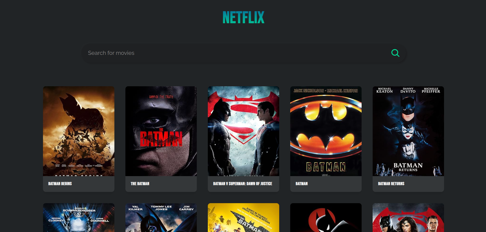
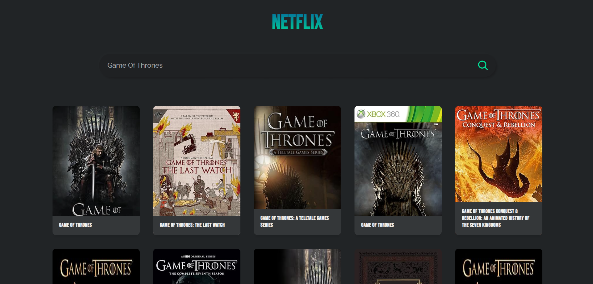
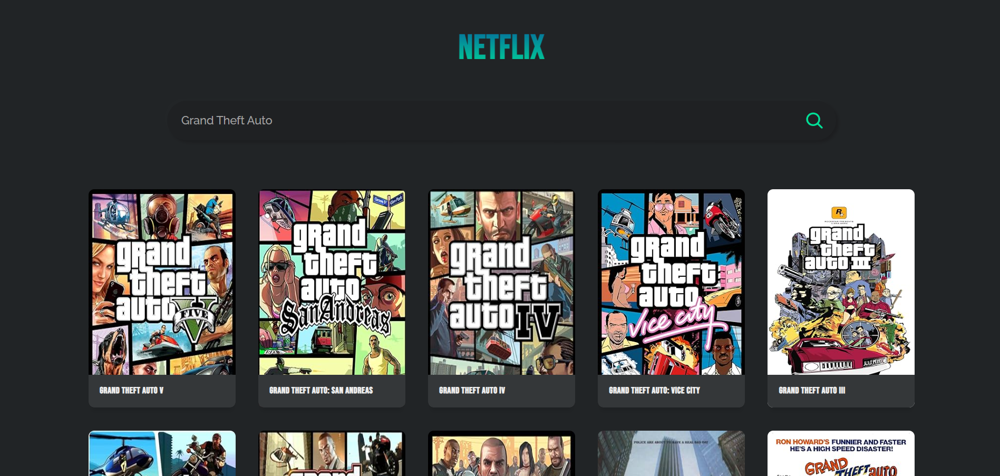

# Getting Started with Create React App

Author: [Assad Mustafa](https://github.com/assadmustafa).

## Introduction
This is a project to build a website that gets data from an API loaded with a big database of movies, tv-series and video games. The data will be transformed into well-organised user interface to provide all information about the article the user's looking for.

## Available Scripts

In the project directory, you can run:

### `npm install`

Installs node modules.\

### `npm start`

Runs the app in the development mode.\

Open [http://localhost:3000](http://localhost:3000) to view it in your browser.
